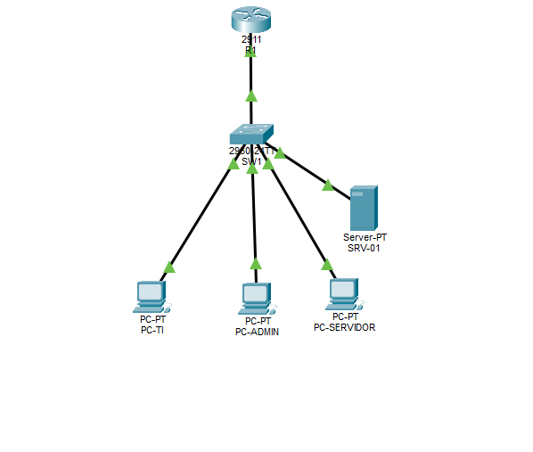
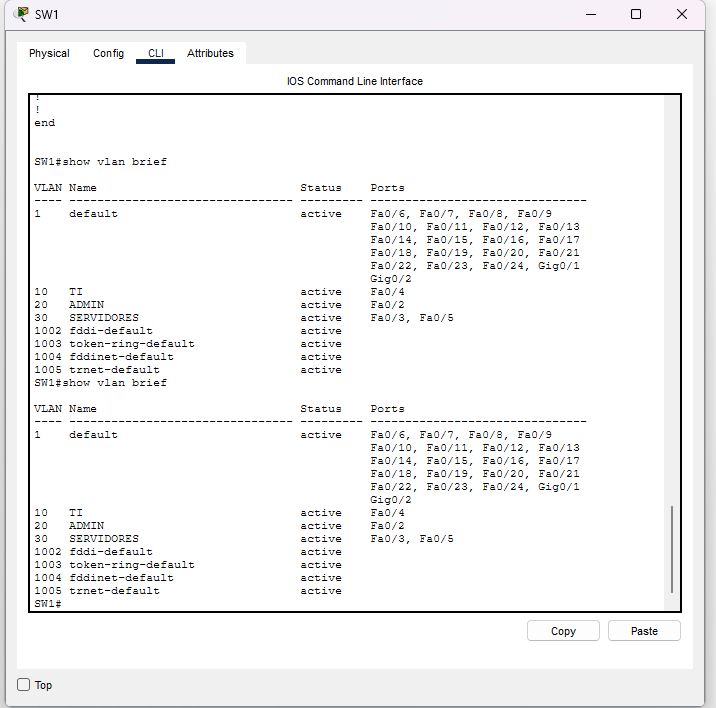
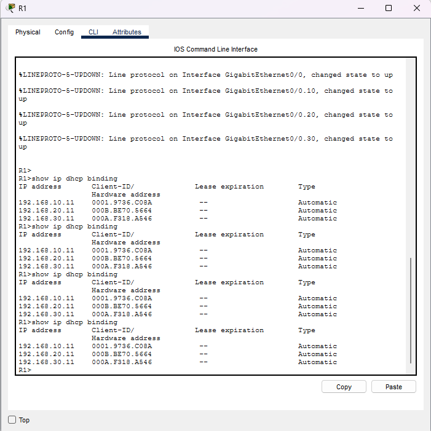
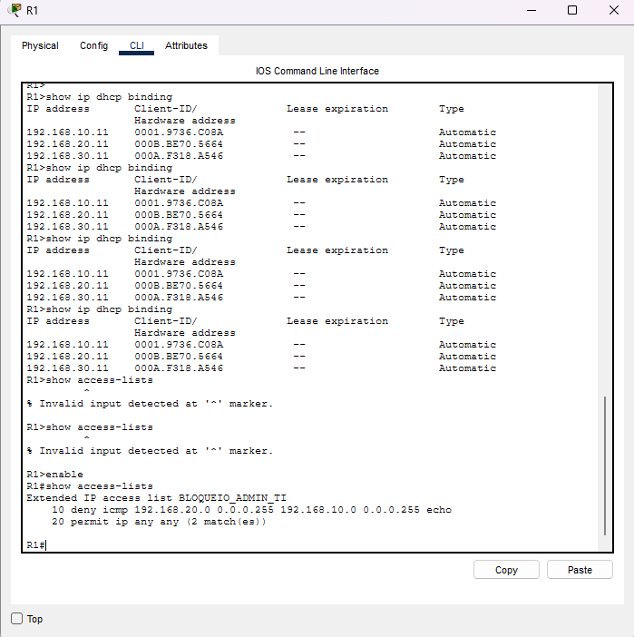
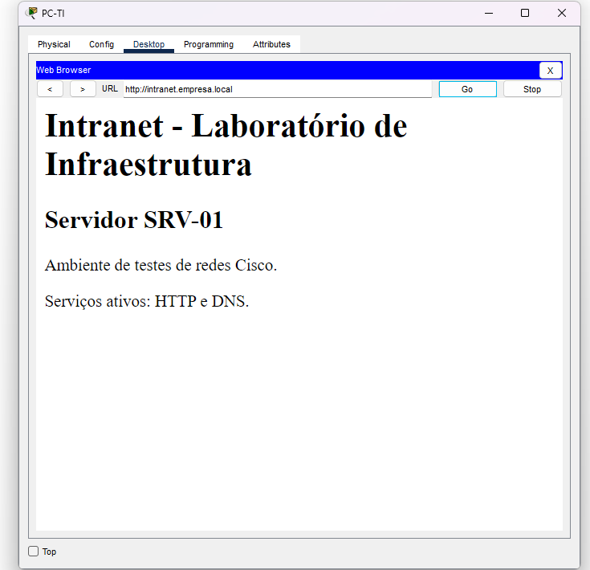

# Laboratório de Infraestrutura e Redes

Projeto prático desenvolvido para aplicar conhecimentos de infraestrutura de TI, redes Cisco, segmentação de rede, serviços de rede, segurança e troubleshooting.

O laboratório é dividido em dois módulos:

1. Cisco Packet Tracer
2. Windows Server e Active Directory

---

## Módulo 1 — Cisco Packet Tracer

Foi criada uma pequena infraestrutura de rede corporativa utilizando VLANs, roteamento inter-VLAN, DHCP, DNS, HTTP e controle de acesso através de ACL.

### Topologia

A rede foi segmentada em três VLANs:

| VLAN | Setor | Rede | Gateway |
|---|---|---|---|
| 10 | TI | `192.168.10.0/24` | `192.168.10.1` |
| 20 | ADMIN | `192.168.20.0/24` | `192.168.20.1` |
| 30 | SERVIDORES | `192.168.30.0/24` | `192.168.30.1` |

### Equipamentos utilizados

- Cisco Router 2911
- Cisco Switch 2960
- PCs clientes
- Server-PT

---

## Arquitetura da rede

```text
                         R1
                  Cisco Router 2911
                         |
                  Router-on-a-Stick
                         |
                    802.1Q Trunk
                         |
                        SW1
                  Cisco Switch 2960
             ____________|____________
            |            |            |
         VLAN 10       VLAN 20      VLAN 30
            TI           ADMIN      SERVIDORES
            |             |          |      |
          PC-TI       PC-ADMIN   PC-SERV   SRV-01
                                             |
                                        HTTP / DNS
```

---

## VLANs

Foram configuradas três VLANs para segmentar os dispositivos de acordo com cada setor:

```text
VLAN 10 - TI
VLAN 20 - ADMIN
VLAN 30 - SERVIDORES
```

As portas utilizadas no switch foram configuradas como portas Access para os dispositivos finais.

### Distribuição das portas

```text
Fa0/4 → VLAN 10 → PC-TI
Fa0/2 → VLAN 20 → PC-ADMIN
Fa0/3 → VLAN 30 → PC-SERVIDOR
Fa0/5 → VLAN 30 → SRV-01
```

A conexão entre o switch e o roteador utiliza uma porta configurada como trunk 802.1Q.

---

## Router-on-a-Stick

O roteamento entre VLANs foi realizado através de subinterfaces no roteador.

```text
G0/0.10 → 192.168.10.1
G0/0.20 → 192.168.20.1
G0/0.30 → 192.168.30.1
```

Cada subinterface utiliza encapsulamento IEEE 802.1Q correspondente à VLAN.

Exemplo:

```text
interface GigabitEthernet0/0.10
 encapsulation dot1Q 10
 ip address 192.168.10.1 255.255.255.0
```

---

## DHCP

O roteador foi configurado como servidor DHCP para as três VLANs.

Foram criados pools separados:

```text
VLAN10_TI
VLAN20_ADMIN
VLAN30_SERVIDORES
```

Os dispositivos receberam automaticamente:

```text
PC-TI
IP: 192.168.10.11
Gateway: 192.168.10.1

PC-ADMIN
IP: 192.168.20.11
Gateway: 192.168.20.1

PC-SERVIDOR
IP: 192.168.30.11
Gateway: 192.168.30.1
```

Os endereços iniciais das redes foram reservados para equipamentos de infraestrutura e servidores.

---

## Servidor SRV-01

Foi adicionado um servidor à VLAN 30 com endereço IP fixo:

```text
Hostname: SRV-01
IP: 192.168.30.10
Máscara: 255.255.255.0
Gateway: 192.168.30.1
DNS: 192.168.30.10
```

### Serviços configurados

- HTTP
- DNS

---

## Intranet

Foi criado um serviço HTTP interno no `SRV-01`.

A página pode ser acessada através do endereço IP:

`http://192.168.30.10`

Também foi configurado um registro DNS interno:

```text
intranet.empresa.local
        ↓
192.168.30.10
```

Permitindo o acesso através de:

`http://intranet.empresa.local`

---

## DNS

O `SRV-01` também atua como servidor DNS interno.

O DHCP foi ajustado para distribuir:

```text
DNS Server: 192.168.30.10
```

para os clientes das VLANs.

Dessa forma, os computadores conseguem resolver o nome:

```text
intranet.empresa.local
```

para:

```text
192.168.30.10
```

---

## ACL — Controle de Acesso

Foi criada uma ACL estendida para controlar o tráfego entre as VLANs.

A regra implementada bloqueia solicitações ICMP iniciadas pela rede administrativa contra a rede de TI.

```text
ADMIN → TI = bloqueado para ICMP
ADMIN → SERVIDORES = permitido
TI → ADMIN = permitido
TI → SERVIDORES = permitido
```

ACL configurada:

```text
deny icmp 192.168.20.0 0.0.0.255 192.168.10.0 0.0.0.255 echo
permit ip any any
```

A ACL foi aplicada na entrada da subinterface correspondente à VLAN 20.

---

## Testes realizados

Foram realizados testes para validar a comunicação e as regras configuradas.

### Roteamento inter-VLAN

```text
PC-TI → PC-ADMIN
OK

PC-TI → PC-SERVIDOR
OK

PC-ADMIN → PC-SERVIDOR
OK
```

### Teste da ACL

```text
PC-ADMIN → PC-TI
Bloqueado
```

O contador da ACL confirmou que os pacotes ICMP foram interceptados pela regra de bloqueio.

### Serviços

Também foram validados:

- obtenção automática de endereço via DHCP;
- resolução DNS;
- acesso HTTP por endereço IP;
- acesso HTTP por nome DNS.

---

## Troubleshooting realizado

Durante a montagem do laboratório ocorreu uma falha de comunicação entre os dispositivos e o gateway.

Inicialmente, o trunk foi configurado em uma porta diferente daquela que estava fisicamente conectada ao roteador.

Foram utilizados comandos de diagnóstico como:

```text
show interfaces status
show interfaces trunk
show interfaces switchport
show ip interface brief
show cdp neighbors
show ip dhcp binding
show access-lists
```

O comando:

```text
show cdp neighbors
```

permitiu identificar a interface do switch que estava fisicamente conectada ao roteador.

Após ajustar a configuração do trunk para a interface utilizada, o roteamento entre VLANs e o DHCP passaram a funcionar normalmente.

Esse processo foi utilizado como exercício de troubleshooting de camada física, VLAN, trunk e roteamento.

---

## Evidências do laboratório

### Topologia



### VLANs



### DHCP



### ACL



### Intranet e DNS



---

## Principais conceitos aplicados

- Cisco Packet Tracer
- IPv4
- VLAN
- Portas Access
- Trunk IEEE 802.1Q
- Router-on-a-Stick
- Roteamento inter-VLAN
- DHCP
- DNS
- HTTP
- ACL
- Gateway
- Troubleshooting
- Cisco IOS

---

## Estrutura do repositório

```text
laboratorio-infraestrutura-redes/
│
├── README.md
│
├── packet-tracer/
│   ├── laboratorio-infraestrutura-redes.pkt
│   ├── configuracao-r1.txt
│   ├── configuracao-sw1.txt
│   └── imagens/
│       ├── topologia.png
│       ├── vlans.png
│       ├── dhcp.png
│       ├── acl.png
│       └── intranet-dns.png
│
└── active-directory/
    ├── README.md
    └── imagens/
```

---

## Arquivos de configuração

As configurações completas dos equipamentos Cisco estão disponíveis em:

```text
packet-tracer/configuracao-r1.txt
packet-tracer/configuracao-sw1.txt
```

O arquivo do laboratório pode ser aberto diretamente no Cisco Packet Tracer:

```text
packet-tracer/laboratorio-infraestrutura-redes.pkt
```

---

## Módulo 2 — Windows Server e Active Directory

A segunda etapa deste projeto será dedicada à construção de um ambiente Windows Server.

O laboratório incluirá:

- Windows Server
- Active Directory Domain Services
- criação de domínio
- Organizational Units (OUs)
- usuários e grupos
- ingresso de computadores no domínio
- Group Policy (GPO)
- DNS
- DHCP
- permissões
- administração de ambiente corporativo

A documentação desse módulo ficará disponível em:

```text
active-directory/README.md
```

> Módulo em desenvolvimento.

---

## Objetivo do projeto

Este projeto tem como objetivo desenvolver e documentar habilidades práticas relacionadas a infraestrutura e redes, simulando tarefas encontradas em ambientes corporativos.

Além da configuração dos serviços, o laboratório também busca demonstrar capacidade de diagnóstico e resolução de problemas através de ferramentas e comandos de troubleshooting.