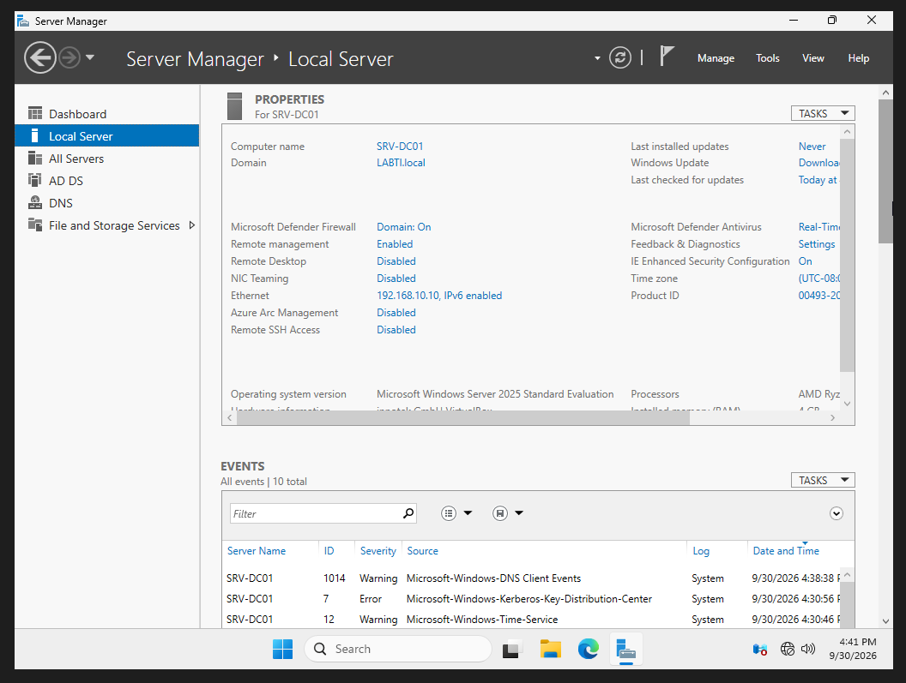
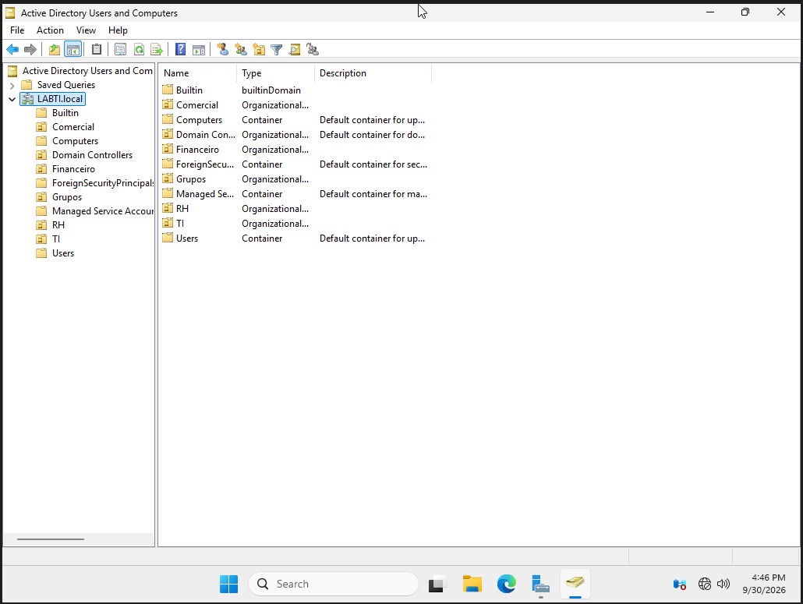
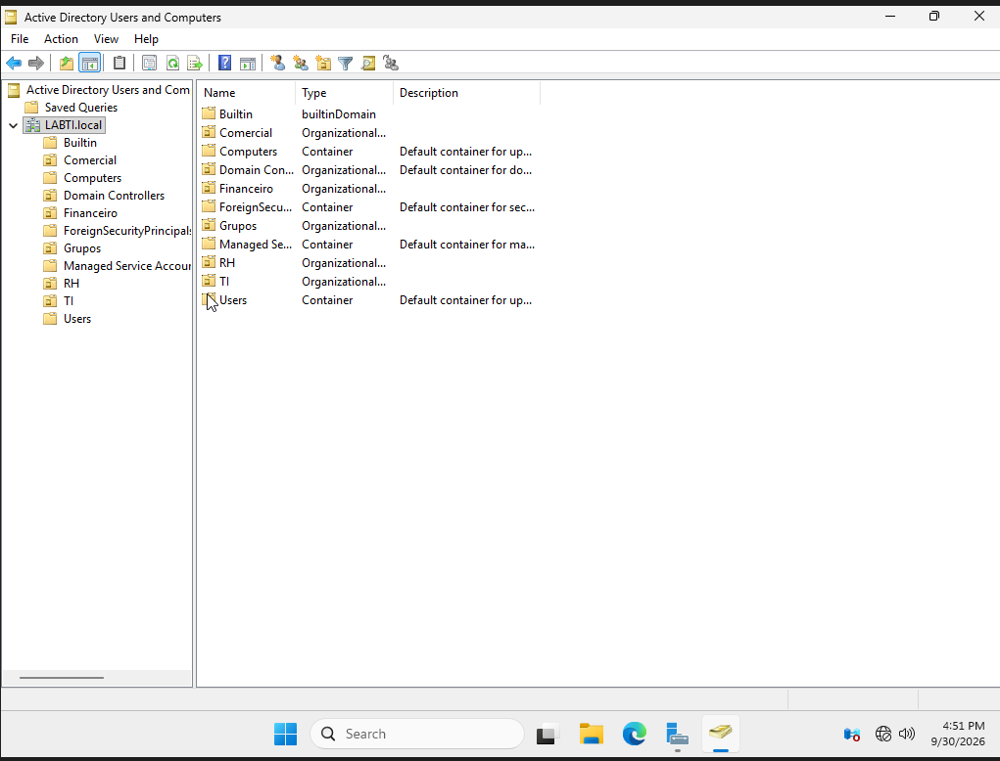
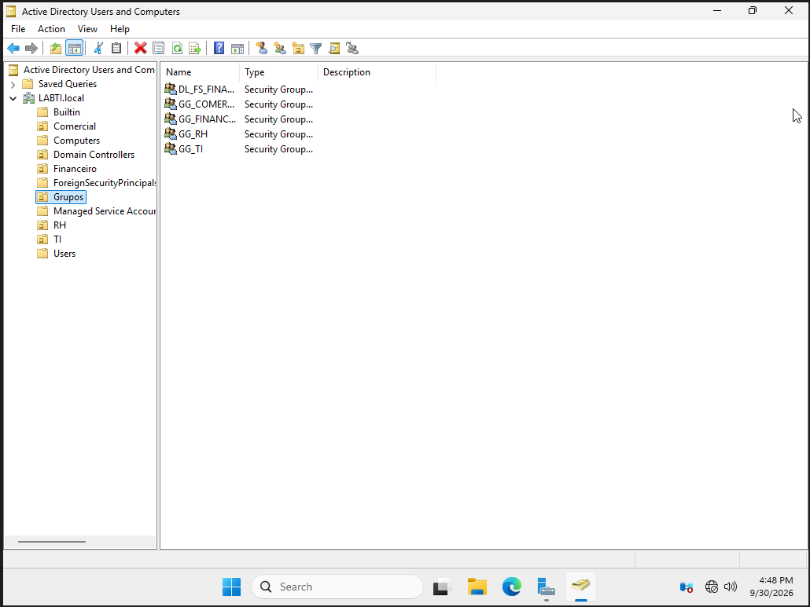
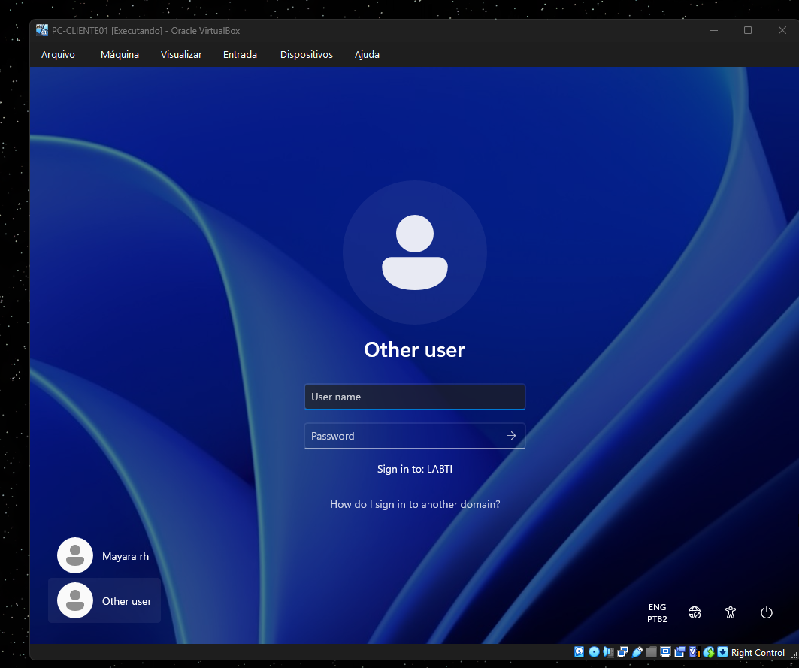
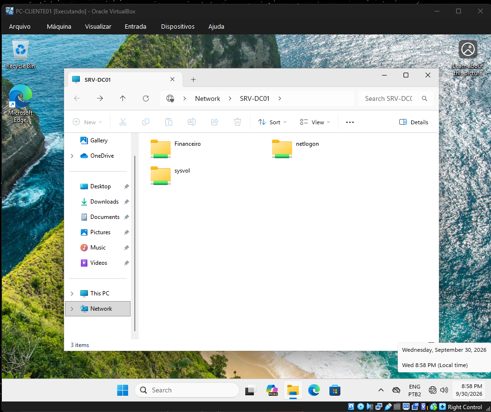
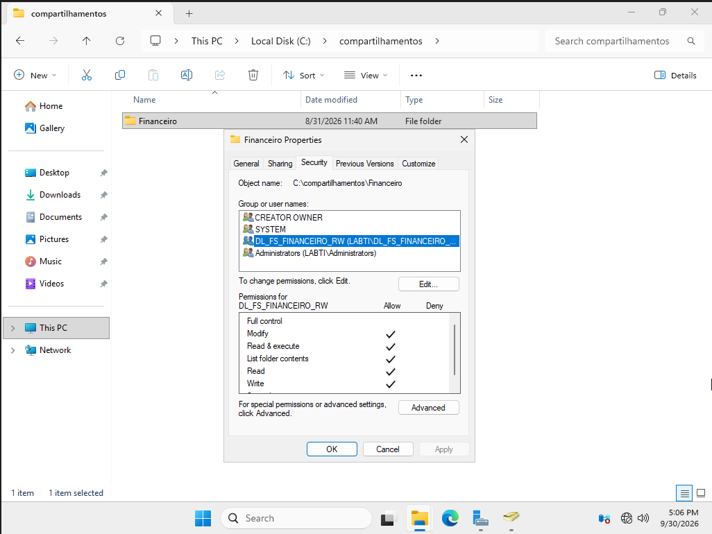
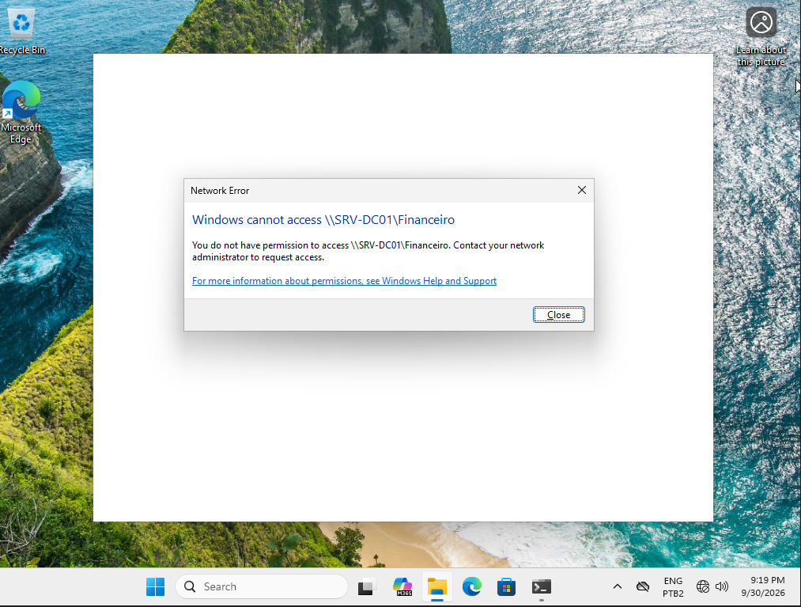
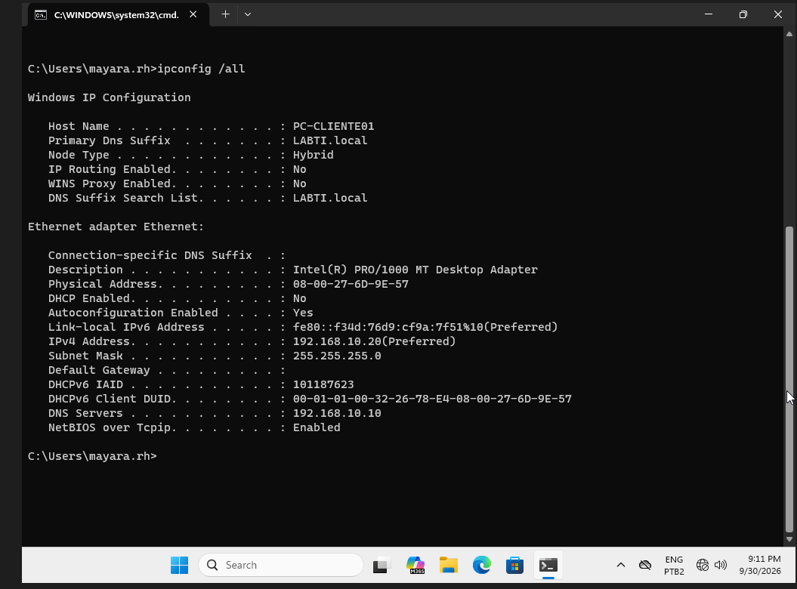
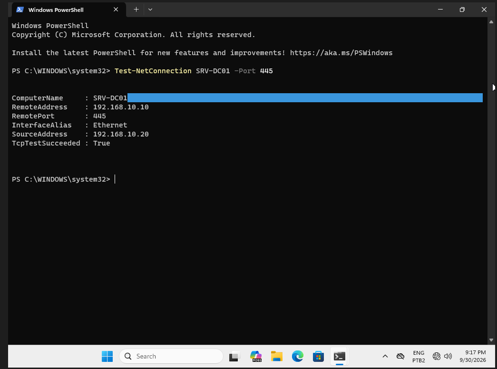

# Laboratório Active Directory

Este módulo faz parte do projeto **Laboratório de Infraestrutura e Redes** e documenta a criação de um ambiente corporativo utilizando Windows Server e Active Directory.

O objetivo foi praticar administração de domínio, gerenciamento de usuários e grupos, DNS, políticas, compartilhamentos de rede, permissões NTFS e troubleshooting.

---

## Ambiente utilizado

- Oracle VirtualBox
- Windows Server 2025
- Windows 11 Pro
- Active Directory Domain Services
- DNS
- SMB
- NTFS

### Servidor

```text
Hostname: SRV-DC01
Domínio: LABTI.local
Função: Domain Controller
IP: 192.168.10.10
```

### Cliente

```text
Hostname: PC-CLIENTE01
Sistema: Windows 11 Pro
IP: 192.168.10.20
Função: Estação cliente integrada ao domínio
DNS: 192.168.10.10
```

---

## Arquitetura do laboratório

```text
                    SRV-DC01
                Windows Server 2025
                       |
                Active Directory
                       |
               Domínio LABTI.local
                       |
              DNS / Usuários / Grupos
                       |
                  Rede interna
                       |
                PC-CLIENTE01
                Windows 11 Pro
                       |
                Membro do domínio
```

---

## Active Directory Domain Services

Foi instalada e configurada a função:

```text
Active Directory Domain Services (AD DS)
```

O servidor foi promovido a controlador de domínio do ambiente:

```text
LABTI.local
```

Após a promoção, o servidor passou a centralizar:

- autenticação de usuários;
- gerenciamento de computadores;
- grupos de segurança;
- políticas;
- recursos compartilhados;
- resolução DNS do domínio.

---

## Estrutura organizacional

Foram utilizadas **Organizational Units (OUs)** para organizar os objetos do Active Directory.

Estrutura utilizada no laboratório:

```text
LABTI.local
│
├── Comercial
├── Financeiro
├── Grupos
├── RH
└── TI
```

A utilização de OUs facilita a administração e permite organizar usuários e recursos por setor.

---

## Usuários

Foram criadas contas de usuários no Active Directory para simular funcionários de diferentes departamentos.

Foram praticadas tarefas como:

- criação de usuários;
- definição de senha inicial;
- alteração de senha;
- redefinição de senha;
- habilitação e administração de contas;
- organização dos usuários dentro das OUs.

---

## Grupos de segurança

Foram criados grupos de segurança para facilitar o gerenciamento de permissões.

Entre os grupos utilizados no laboratório estão:

```text
GG_COMERCIAL
GG_FINANCEIRO
GG_RH
GG_TI
DL_FS_FINANCEIRO_RW
```

O uso de grupos evita a atribuição direta de permissões a usuários individuais e facilita a administração do ambiente.

---

## Modelo AGDLP

Foi aplicado o modelo:

```text
A → Accounts
G → Global Groups
DL → Domain Local Groups
P → Permissions
```

Fluxo utilizado:

```text
Usuário
   ↓
Grupo Global
   ↓
Grupo Local de Domínio
   ↓
Permissão no recurso
```

Exemplo:

```text
Usuário do Financeiro
        ↓
GG_FINANCEIRO
        ↓
DL_FS_FINANCEIRO_RW
        ↓
Permissão na pasta Financeiro
```

Esse modelo ajuda a organizar o gerenciamento de acessos em ambientes Active Directory.

---

## Compartilhamentos SMB

Foi criada uma pasta compartilhada utilizando SMB para simular um recurso corporativo de rede.

Compartilhamento utilizado:

```text
\\SRV-DC01\Financeiro
```

Também foram visualizados os compartilhamentos padrão do domínio:

```text
\\SRV-DC01\netlogon
\\SRV-DC01\sysvol
```

O laboratório permitiu praticar:

- criação de compartilhamentos;
- acesso por caminho UNC;
- controle de acesso por grupo;
- validação de conectividade SMB.

---

## Permissões NTFS

Foram configuradas permissões NTFS para controlar o acesso à pasta:

```text
C:\compartilhamentos\Financeiro
```

O grupo:

```text
DL_FS_FINANCEIRO_RW
```

recebeu permissões de:

- Modify;
- Read & execute;
- List folder contents;
- Read;
- Write.

As permissões foram associadas a grupos do Active Directory, seguindo o modelo AGDLP.

---

## Testes de acesso

Foram utilizados usuários pertencentes a grupos diferentes para validar o controle de acesso.

### Usuário autorizado

```text
Usuário
   ↓
Grupo Global correto
   ↓
Grupo Local de Domínio
   ↓
Permissão NTFS
   ↓
Acesso permitido
```

### Usuário não autorizado

```text
Usuário
   ↓
Sem associação ao grupo autorizado
   ↓
\\SRV-DC01\Financeiro
   ↓
Access Denied
```

O teste confirmou que o acesso ao compartilhamento depende das permissões configuradas para os grupos.

---

## Ingresso do Windows 11 no domínio

A máquina:

```text
PC-CLIENTE01
```

foi integrada ao domínio:

```text
LABTI.local
```

Após o ingresso no domínio, a estação passou a permitir autenticação com contas do Active Directory.

Na tela de login é exibido:

```text
Sign in to: LABTI
```

confirmando a associação ao domínio.

---

## DNS

O DNS foi utilizado como parte fundamental do Active Directory.

No cliente foi configurado:

```text
DNS Server: 192.168.10.10
```

correspondente ao controlador de domínio `SRV-DC01`.

O cliente também utiliza o sufixo:

```text
LABTI.local
```

A resolução de nomes foi validada para:

```text
SRV-DC01.LABTI.local
```

apontando para:

```text
192.168.10.10
```

---

## Group Policy — GPO

O laboratório também foi utilizado para praticar conceitos relacionados a Group Policy.

As GPOs permitem aplicar configurações centralizadas a usuários e computadores do domínio.

Foram estudados conceitos como:

- políticas de domínio;
- administração centralizada;
- aplicação de configurações;
- atualização de políticas;
- gerenciamento de usuários e computadores.

---

## Troubleshooting

Durante o laboratório foram utilizados comandos e ferramentas de diagnóstico para validar conectividade, DNS e compartilhamentos.

### Verificar configuração de rede

```powershell
ipconfig /all
```

### Testar conectividade

```powershell
ping SRV-DC01
```

### Testar DNS

```powershell
nslookup SRV-DC01
```

### Testar porta SMB

```powershell
Test-NetConnection SRV-DC01 -Port 445
```

Resultado validado:

```text
ComputerName     : SRV-DC01
RemoteAddress    : 192.168.10.10
RemotePort       : 445
SourceAddress    : 192.168.10.20
TcpTestSucceeded : True
```

### Listar compartilhamentos SMB no servidor

```powershell
Get-SmbShare
```

Esses comandos foram utilizados para identificar e validar:

- conectividade;
- resolução DNS;
- comunicação com o controlador de domínio;
- acesso aos compartilhamentos;
- disponibilidade da porta SMB 445.

---

## Evidências do laboratório

### Servidor Windows Server



### Active Directory



### Organizational Units



### Usuários e grupos



### Cliente integrado ao domínio



### Compartilhamento SMB



### Permissões NTFS



### Controle de acesso



### Configuração DNS



### Troubleshooting de rede



---

## Principais conceitos aplicados

- Windows Server 2025
- Active Directory Domain Services
- Domain Controller
- DNS
- Organizational Units
- Usuários
- Grupos de segurança
- AGDLP
- Group Policy
- SMB
- NTFS
- Permissões
- Windows 11 integrado ao domínio
- Administração de usuários
- Controle de acesso
- Troubleshooting

---

## Objetivo

O objetivo deste módulo foi desenvolver habilidades práticas relacionadas à administração de ambientes Windows corporativos.

O laboratório permitiu praticar desde a criação do domínio até o gerenciamento de usuários, grupos, permissões, compartilhamentos e diagnóstico de problemas.

Este módulo complementa o laboratório Cisco Packet Tracer presente no repositório principal, formando um projeto voltado a **infraestrutura, redes e suporte de TI**.